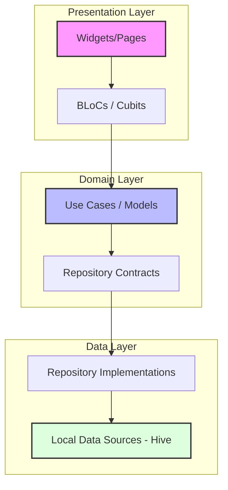

# ☕️ Raksa Coffee POS System

A premium, modern, offline-first Point of Sale (POS) application designed specifically for the Cambodian boutique coffee shop market. Built using Flutter and following Clean Architecture principles, it delivers a high-performance desktop and mobile checkout experience.

---

## 🚀 Key Features

*   **🇺🇸 🇰ខ្មែរ Dual-Currency System**: Optimized for local transactions, displaying base prices in US Dollars (USD) and automatic conversions in Khmer Riel (KHR) at a fixed store exchange rate of **1 USD = 4,000 ៛**.
*   **💵 Bank Note Quick-Cash Register**: High-speed tender calculations with split banknote grid buttons:
    *   **USD Bills**: `$5`, `$10`, `$20`, `$50`, `$100`
    *   **Khmer Riel Bills**: `10,000 ៛`, `20,000 ៛`, `50,000 ៛`, `100,000 ៛` (with automatic conversion into order models)
*   **📱 ABA KHQR QR-Pay Integration**: QR payment drawer displays a real scanable payment code pointing directly to your merchant ABA payment link, styled with standard Bakong/KHQR branding.
*   **🛍️ Dynamic Menu & Category Builder**: Add new products and custom categories inline. Instantly re-seeds local caches on save.
*   **🔄 Multilingual Support**: Dynamic runtime translations between English and Khmer (using `.tr(context)` delegates), including category tabs, sidebars, registers, and receipts.
*   **🎟️ Modern Digital Receipt Ticket**: Replaces standard terminal layouts with a sleek digital invoice slip featuring dashed divider segments, checkout tags, and simulated barcode trackers.
*   **📊 Business Analytics Dashboard**: Real-time gross sales trackers, order frequency metrics, average tickets, top-selling items lists, and daily sales reprint logs.
*   **💾 Offline-First Architecture**: Stores and queries products, modifiers, active queues, and checkout orders locally using lightweight Hive database caches.

---

## 🛠️ Technology Stack

*   **Framework**: [Flutter](https://flutter.dev) (macOS desktop client and Google Chrome Web targets)
*   **State Management**: [flutter_bloc](https://pub.dev/packages/flutter_bloc) & [equatable](https://pub.dev/packages/equatable)
*   **Local Storage Database**: [hive](https://pub.dev/packages/hive) & [hive_flutter](https://pub.dev/packages/hive_flutter)
*   **Date & Math Formatting**: [intl](https://pub.dev/packages/intl)
*   **Unique IDs Generation**: [uuid](https://pub.dev/packages/uuid)

---

## 🏗️ Architecture Blueprint

The project is structured under **Clean Architecture** patterns, separating concerns into presentation, domain, and data layers:



### Directory Structure

```directory
lib/
├── core/                           # Shared utilities, constants, themes
│   ├── network/                    # Hive offline database drivers
│   ├── theme/                      # Light/Dark Color themes
│   └── utils/                      # Currency conversions & receipt generators
│
├── features/                       # Feature-driven modules
│   ├── cart/                       # Orders queue, item tiles, and modifiers BLoC
│   ├── checkout/                   # Pay panels, ledger reports, and receipts
│   └── menu/                       # Grid layouts, search chips, and catalog editor
│
├── l10n/                           # Multilingual ARB localization delegates
└── main.dart                       # App initialization & entrypoint
```

---

## 🏁 How to Run

Follow these instructions to start the POS system locally on your development machine.

### Prerequisites

*   Flutter SDK installed ([Installation Guide](https://docs.flutter.dev/get-started/install))
*   Desktop target enabled (`flutter config --enable-macos-desktop`)

### Steps

1.  **Clone the workspace** and navigate to the project directory:
    ```bash
    cd "/Users/panha/Desktop/POS System"
    ```

2.  **Restore dependencies**:
    ```bash
    flutter pub get
    ```

3.  **Run on Native macOS Desktop client**:
    ```bash
    flutter run -d macos
    ```

4.  **Run on Google Chrome browser**:
    ```bash
    flutter run -d chrome
    ```

---

## 🎨 System Design Guidelines

*   **Card Aspect Ratios**: Child cards are bound to a `0.70` aspect ratio to fit custom network images and item labels cleanly without text truncation.
*   **Theme Integration**: Supports light and dark modes, utilizing a warm mocha palette for coffee houses.
*   **Dual Currency Display**:
    *   USD Format: `\$X.XX`
    *   KHR Format: `Y,YYY ៛`
